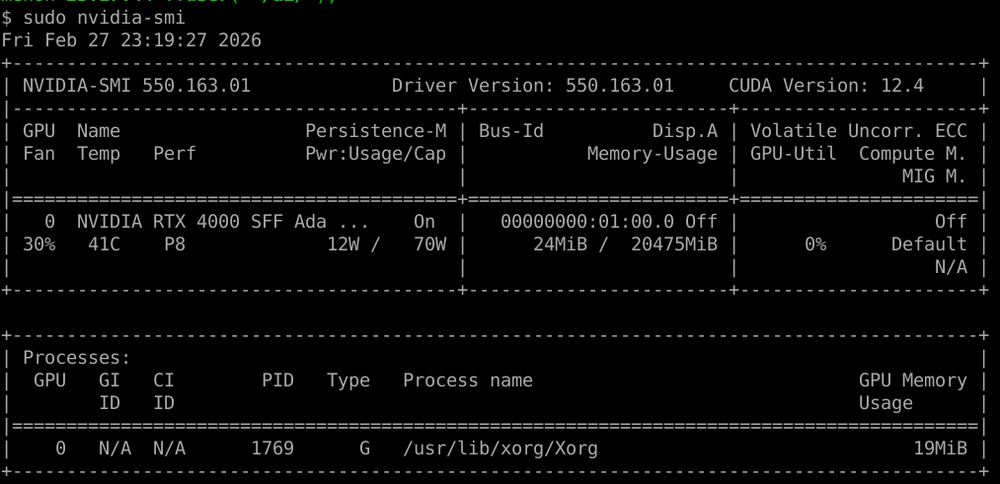
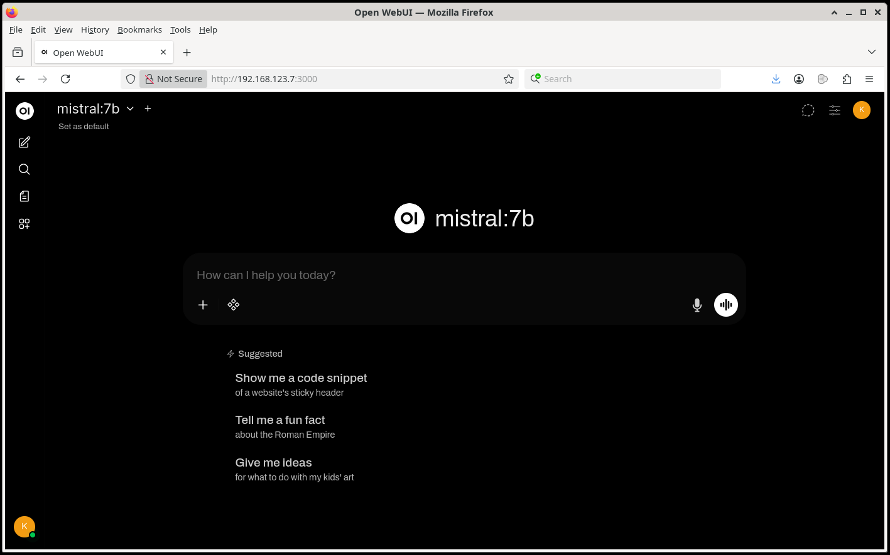
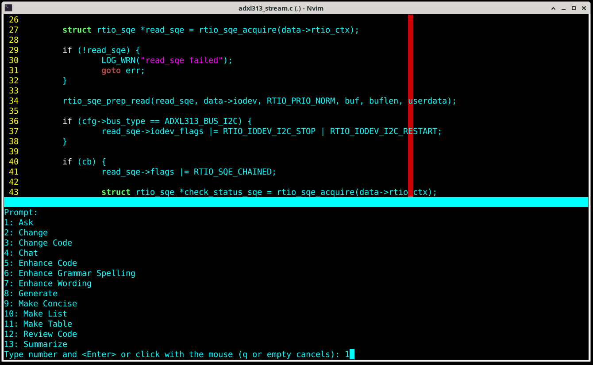
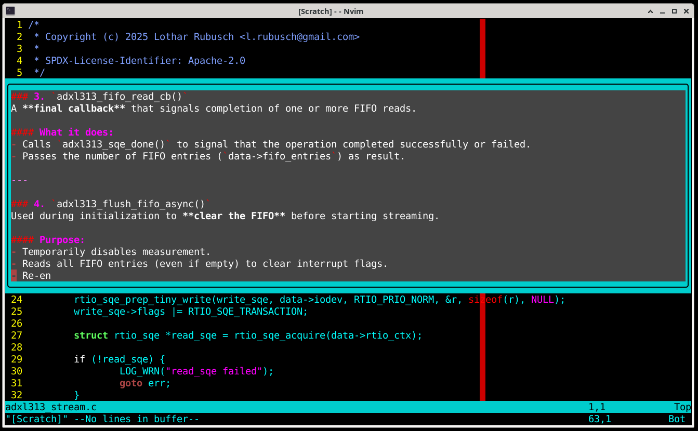
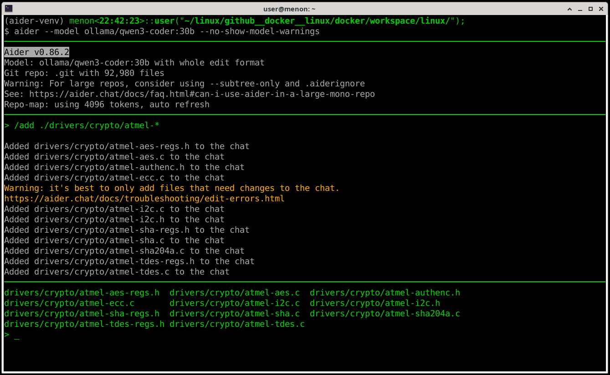
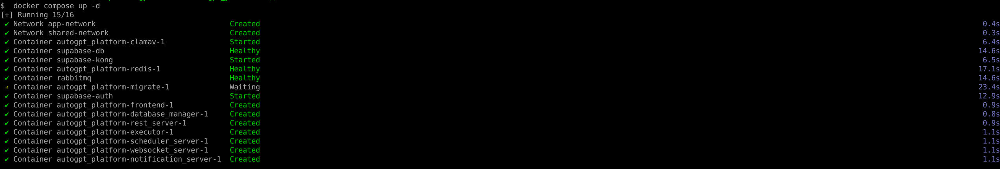

# Lothar's Little AI Setup
- **All local**
- **All free**
- **All independent**

## Objective

A locally running semi-autonomous free and independent agent. Thus minimalized
and focussed just on coding tasks.

Note, the setup can be connected to API-LLMs.

My setup is a Debian Linux testing/sid (as base), having 128GB RAM and 20GB VRAM
GPU. The system will host a quantized 30B param LLM, dockerized. This will be
accessible by WebUI (browser), by neovim plugin, and/or in a semi-autonomous
agent using Aider.

# GPU: NVIDIA
Alternatively, running on pure CPU this setup will suffer badly. Alternatively,
connect it to AI APIs online and live with the consequences. In such case,
there's no need to set it up as "minimal" setup.

Make sure nvidia drivers are setup in the package manager, further install the `nvidia-container-toolkit`.
ref: https://docs.nvidia.com/datacenter/cloud-native/container-toolkit/latest/install-guide.html

### NVIDIA driver installation
Always when the kernel was updated, the nvidia modules need to be re-build!  
```
$ sudo apt update                                                               
```
                                                                             
Get sources and reinstall drivers  
```
$ sudo apt install -y linux-headers-$(uname -r)                                 
$ sudo apt install --reinstall nvidia-driver nvidia-kernel-dkms                 
                                                                                
(opt) probably not needed, but in case of trouble with docker - update docker toolkit packages
$ sudo apt install -y nvidia-container-toolkit                                  
$ sudo nvidia-ctk runtime configure --runtime=docker                            
$ sudo systemctl restart docker
```


### NVIDIA docker integration
```
$ sudo apt update
$ sudo apt install -y zstd
$ sudo apt install -y nvidia-container-toolkit
$ sudo nvidia-ctk runtime configure --runtime=docker
$ sudo systemctl restart docker
```
NVIDIA sanity checks for docker container
```
$ docker info | grep -i nvidia
$ docker run --rm --gpus all nvidia/cuda:12.4.1-base-ubuntu22.04 nvidia-smi
```

# OLLAMA Container
The LLM environment, several LLMs can be installed. The LLM storage is persistent.
### Build OLLAMA container
First usage:
```
$ cd ./01_docker-ollama/
01$ docker build -t ollama-local .
01$ docker network create ollama-net
01$ docker run -d --name ollama --network ollama-net --gpus all -p 11434:11434 -v ollama-data:/root/.ollama ollama-local
```
(opt) Alternatively, do the CPU only version
```
01$ docker run -d --name ollama --network ollama-net -p 11434:11434 -v ollama-data:/root/.ollama ollama-local
```
In case remove a stale container (removes also chat history)
```
$ docker rm -f ollama
```
### Install LLMs for OLLAMA Container
Find available models here: https://www.ollama.com/  

[01/2026]: Given a focus on C/C++/Python/Rust for Zephyr RTOS, Linux kernel, U-boot with a limitation here of 20GB:
- Primary pick: Qwen3-Coder (quantized 30B) - best on benchmarked code tasks, huge context helps Linux/U-boot code.
- Alternative: DevStral-Small-2
- General pick: Mistral2
- Alternative: qwen3:14b

List installed LLMs
```
$ docker start ollama
$ docker exec ollama ollama list
    NAME                    ID              SIZE      MODIFIED
    cogito:32b              0b4aab772f57    19 GB     About an hour ago
    cogito:14b              d0cac86a2347    9.0 GB    2 hours ago
    mistral-small3.2:24b    5a408ab55df5    15 GB     4 hours ago
    mistral:7b              6577803aa9a0    4.4 GB    2 weeks ago
    qwen3-coder:30b         06c1097efce0    18 GB     5 weeks ago
```
Install LLM, note the in some cases billion params needs to be specified, e.g.
`qwen3:14b` or `qwen3-coder:30b`. Note, OLLAMA takes care of quantization, so in
case of this system 30 billion params are actually too much, anyway, OLLAMA
downloads the quantized version (if available), anyway it occupies 18GB disk
space.

### Higher paremetrization vs higher quantization

Quantization trades numerical precision for memory savings.
Effect:
- Slightly worse reasoning stability
- Slightly higher hallucination rate
- Slightly weaker long-chain logic
- Usually still better than a smaller full-precision 7b model

So the real question is not "is it quantized?" -  The question is: Does a 24b quantized model outperform an 8b full model for your
particular use case?   

The 24b class model will:
- track multi-layer context better
- reason about people with more nuance
- produce less shallow advice
- handle longer structured planning

The tradeoff with a localized system will be:
- run close to VRAM limit
- possibly see slower token generation
- maybe experience small quality degradation vs full precision

```
$ docker exec -it ollama ollama pull qwen3-coder
```
or remove a model
```
$ docker exec -it ollama ollama rm qwen3:14b
```
The new model should appear in the above list. From webui, use the Model
Selector Dropdown to select a model. Or, re-run the docker command to build it
as default model.  

Check the LLM in local container and shell access
```
$ docker exec -it ollama bash
$ ollama run qwen3-coder:30b
```
or
```
$ docker exec -it ollama ollama run qwen3-coder:30b
```

### Start OLLAMA Container
```
$ docker start ollama
```
-> **OLLAMA** is reachable at: http://localhost:11434

# WebUI Container
The browser frontend to talk to the AI. Chats are not persistent over removeing container instance, if not explicitely saved!
### Build WebUI container
First usage:
```
$ cd ./02_docker-webui/
02$ $ docker build -t ollama-webui .
02$ docker run -d --name ollama-webui --network ollama-net -p 3000:8080 -e OLLAMA_BASE_URL=http://ollama:11434 ollama-webui
```
### Start WebUI Container
```
$ docker start ollama-webui
```


-> **WebUI** is reachable in browser: http://localhost:3000

# Application: Neovim (integration)
### Neovim configuration
setup config (in case paste with SHIFT+CTRL+v)
- install lazy.nvim plugin manager
- install gen.nvim and configure it to talk to ollama
```
$ nvim ~/.config/nvim/init.lua
-- bootstrap lazy.nvim
local lazypath = vim.fn.stdpath("data") .. "/lazy/lazy.nvim"
if not vim.loop.fs_stat(lazypath) then
  vim.fn.system({
    "git",
    "clone",
    "--filter=blob:none",
    "https://github.com/folke/lazy.nvim.git",
    "--branch=stable",
    lazypath,
  })
end
vim.opt.rtp:prepend(lazypath)

-- plugins
require("lazy").setup({
  {
    "David-Kunz/gen.nvim",
    config = function()
      require("gen").setup({
        model = "qwen3-coder:30b",
        host = "localhost",
        port = "11434",
      })
    end,
  },
})
```

### Neovim usage
start neovim, type `:Gen` to access the menu




```
$ nvim
:Gen
```
test neovim on code, open a code file
```
$ nvim main.c
```
mark some lines
```
v
```
type `:` opens `:'<,'>` then type `Gen`, ENTER
```
:'<,'>Gen
```
- select `1` for `Ask`
- type: `explain this code`

# Application: Aider (semi-autonomous)
Setup semi-autonomous AI-agent tool to refactor, check, bugfix, verify.

### Install Aider setup
```
$ sudo mkdir /opt/aider && sudo chown $(id -u):$(id -g) /opt/aider
$ cd /opt/aider
$ python3 -m venv aider-venv
$ . ./aider-venv/bin/activate
(aider-venv)$ pip install --upgrade pip setuptools wheel
(aider-venv)$ pip install aider-install
(aider-venv)$ aider-install
(aider-venv)$ $ aider --version
    aider 0.86.2
```

configure e.g. in .bashrc something like the following
```
...
export OPENAI_API_BASE=http://localhost:11434
```

### Aider Usage
ref: https://aider.chat/docs/
```
$ . /opt/aider/aider-venv/bin/activate
(aider-venv)$ cd /data/z/github__docker__zephyr/docker/zephyrproject
(aider-venv)$ aider --model ollama/qwen3-coder:30b --no-show-model-warnings
```


Note, aider warns that `qwen3-coder:30b` is unknown to it, but fine to use anyway.  
list of commands: https://aider.chat/docs/usage/commands.html

- Use '!' to do shell commands, e.g. `!ls -l` or `!pwd`
- Go through the code interactively, add files / folders (sub-section of codes) 
- `/add <file>` add files to the context
- `/code` to implement changes
- `/drop` drop all added files
- `/quit` ends the program

use different chet modes
- `/chat-mode ask` for question on code and implementation, or do `/ask ...`
- `/chat-mode code` to implement directly what is described, or `/code ...`
- `/chat-mode help` for help, or `/help ...`
- `/chat-mode architect` to discuss architecture, or `/architect ...`


# Application: AutoGPT (autonomous agent)
Autonomous agent builder (WIP)  
### AutoGPT installation
ref: https://github.com/Significant-Gravitas/AutoGPT
poetry is yet-another python package manager, so I install it globally
```
$ sudo apt update
$ sudo apt install -y python3-poetry
$ sudo apt install nodejs npm
```
AutoGPT installation
```
$ sudo mkdir /opt/autogpt && chown $(id -u):$(id -g) /opt/autogpt
$ cd /opt/autogpt
$ curl -fsSL https://setup.agpt.co/install.sh -o install.sh && bash install.sh
```

Note, here the frontend uses http://localhost:3000, which I already have occupied,
so search for docker-compose.platform.yml and find the frontend section, there set
```
   ports:
     3001:3000
```
Then proceed the installation and expect the frontend at http://localhost:3001  


### AutoGPT Usage
ref: https://agpt.co/docs/platform/getting-started/getting-started  
All commands should be run in: `/opt/autogpt/AutoGPT/autogpt_platform`  

star the setup
```
$ cd /opt/autogpt/AutoGPT/autogpt_platform
$ docker compose up -d
```


stop the entire setup
```
$ cd /opt/autogpt/AutoGPT/autogpt_platform
$ docker compose down
```

TODO


```
$ cd AutoGPT/classic/forge/
$ ./run agent create your_agent_name
```
e.g.
```
$ cd AutoGPT/classic/forge/
$ ./run agent create spock
```
list available agents
```
$ ./run agent list
```

-> **AutoGPT web frontend** can be found at http://localhost:3001

# Miscellaneous
## WebUI Configuration
What Ollama can do? Create derived models using Modelfiles:
- system prompts
- temperature
- context
- adapters (if supported)

Example Modelfile:
```
$ vi ./Modelfile
    FROM qwen3-coder:30b
    PARAMETER temperature 0.2
    SYSTEM "You are a strict C++ code reviewer."
```
Then:
```
$ ollama create qwen3-coder-cpp -f Modelfile
```
This is not training. It’s configuration.

## Ollama Tuning

Possibilities of focussing a LLM on a particular task and context are:
1. Continue Pretraining
  - a huge dataset, i.e. huge amount of GPUs
  - for local setup unrealistic

2. Full Fine-Tuning (all weights change)
  - for 30B models equally unrealistic

3. Parameter-efficient fine-tuning (LoRA / QLoRA)
  - realistic for local setups
  - Retrieval-Augmented Generation (RAG)

### Retrieval-Augmented Generation (RAG)
A kind of pre-indexing for a particular context or subsystem in a huge source-tree, e.g. specialize for a sub-system of the linux
kernel.

Example:
1. Parse the kernel tree: Prepare the codebase for semantic indexing.
2. Split code into meaningful chunks
    - One function per chunk (ideal)
    - Or 200–400 lines
    - Never cut in the middle of a function
    - Keep related structs + helpers together
3. Generate embeddings, use a dedicated embedding model, e.g.:
    - nomic-embed-text
    - mxbai-embed-large
   For each chunk:
    - Send chunk to embedding model
    - Receive numeric vector
    - Store it
4. Store in a vector database, use something lightweight:
    - FAISS
    - Qdrant
    - Chroma
   Each entry contains:
   - Vector
   - Original text chunk
   - File path
   Optional metadata (kernel version, commit hash), this is your semantic index. Save it to disk.
5. This pre-index will be called with each prompt before passing it to the LLM, so the pre-index access will need som scripted
   frontend addition to e.g. Aider. Then the Input on the Aider shell implicitely search the pre-index, come up with the resulting
   vectors and evalute them with the LLM, which reduces hallucinations and results in a more focuessed result for the general coding
   cases in the particular subsystem. Not covered are maintainer policies, architectural stratgies, and edge cases.

There is no reliable benchmark.
- RAG can significantly reduce hallucinations
- it can also inject irrelevant context
- it is overkill for small tasks

Realistically (also AI estimation!):
- Subsystem-level work -> +30 - 70% precision (subjective estimate)
- Simple coding tasks -> barely any difference

TODO scripts added to this repo

## Commands and Usage 
cleanup
```
$ docker stop ollama-webui
$ docker stop ollama
```
clean persistence also
```
$ docker rm -f ollama
$ docker rm -f ollama-webui
```
clean, reestablish network
```
$ docker network create ollama-net
```
start and configure to use up to 19GB (of 20GB) more aggressive usage, using 8192 (if instable alternatively try 6144)
```
01$ docker run -d --name ollama --network ollama-net --gpus all --shm-size=32g -e OLLAMA_GPU_OVERHEAD=1024 -e OLLAMA_NUM_PARALLEL=1 -e OLLAMA_CONTEXT_LENGTH=8192 -p 11434:11434 -v ollama-data:/root/.ollama ollama-local
```
then in 02 start the webUI
```
02$ docker run -d --name ollama-webui --network ollama-net -p 3000:8080 -e OLLAMA_BASE_URL=http://ollama:11434 ollama-webui
```
configure:
- Context Length: 6144 (check this in the log)
- `Max Tokens`: 10000 
- `Temperature`: 0.2 – 0.3
- `Top_p`: 0.9
- `think (Ollama)`: Off (qwen3-code)
- `num_ctx (Ollama)`: 8192 [2048]

stability:
- Parallel Requests: 1 (check in log)
- Streaming: ON

## Remote and Firewall
The OLLAMA server can be accessed within the LAN, also VPN tunneled connects
work but in case need some forwarding setup.

In case tunnel the needed ports out, then on the client the following needs to
stay open:
```
$ ssh -N   -L <port on local>:<OLLAMA server IP>:<port on remote>   <username>@<tunnel peer endpoint IP>
```
e.g the server is in a LAN having the IP 192.168.1.77/24, connecting to some
server (having forwarding, MASQUERADING and routing set), which is VPN endpoint
with IP, say, 192.168.7.3. Multiple ports can be added this way.

Then a command on the local PC connecting to this server remotely is
```
$ ssh -N   -L 3010:192.168.1.77:3000   -L 3011:192.168.1.77:3001   -L 11434:192.168.1.77:11434   user@192.168.7.3
```

verify OLLAMA is accessible
```
curl http://localhost:11434/api/tags
```


# Troubleshooting
```
$ docker logs ollama-webui
```
in case
```
$ docker ps -a
...
```
see if the container is around, in case remove it before rebuilding
```
$ docker rm ollama-webui
$ docker build -t ollama-webui .
```

## Troubleshooting: Login Reset for AutoGPT
```
$  docker compose up -d
[+] Running 16/16
 ✔ Network app-network                               Created                                                                                  0.4s 
 ✔ Network shared-network                            Created                                                                                  0.3s 
 ✔ Container autogpt_platform-clamav-1               Started                                                                                  6.4s 
 ✔ Container supabase-db                             Healthy                                                                                 28.9s 
 ✔ Container supabase-kong                           Started                                                                                  6.5s 
 ✔ Container autogpt_platform-redis-1                Healthy                                                                                 28.9s 
 ✔ Container rabbitmq                                Healthy                                                                                 28.9s 
 ✔ Container autogpt_platform-migrate-1              Exited                                                                                  27.7s 
 ✔ Container supabase-auth                           Started                                                                                 12.9s 
 ✔ Container autogpt_platform-frontend-1             Started                                                                                 26.2s 
 ✔ Container autogpt_platform-database_manager-1     Started                                                                                 26.3s 
 ✔ Container autogpt_platform-rest_server-1          Started                                                                                 25.7s 
 ✔ Container autogpt_platform-executor-1             Started                                                                                 28.9s 
 ✔ Container autogpt_platform-scheduler_server-1     Started                                                                                 28.9s 
 ✔ Container autogpt_platform-websocket_server-1     Started                                                                                 28.6s 
 ✔ Container autogpt_platform-notification_server-1  Started   
```
First generate a hash of a simple password
```
$ python3 -c "import bcrypt; print(bcrypt.hashpw(b'NewPassword123', bcrypt.gensalt()).decode())"
$2b$12$B.uv5NU/0MiNmTxuOKdYCuCT/RZtY6.yig386uR1UtmUciCQ/NMYC
```
Check out the database container, usually this will be postgre, just set up some SQL queries to list up users, then set a new password
```
$ docker ps | grep supabase-db
d6ba228e135f   supabase/postgres:15.8.1.049           "docker-entrypoint.s…"    10 minutes ago   Up 10 minutes (healthy)   0.0.0.0:5432->5432/tcp, :::5432->5432/tcp                                                                                                             supabase-db

$ docker exec -it d6ba228e135f psql -U postgres
psql (15.8)
Type "help" for help.

postgres=> SELECT id, email FROM auth.users;
                  id                  |          email           
--------------------------------------+--------------------------
 dd258e6c-f478-48e5-804d-a52edc6f3af4 | kirk@enterprise.com
 d7ac351b-afa1-48ea-a56e-9454bc6583ac | l.rubusch@protonmail.com
(2 rows)

postgres=> UPDATE auth.users
postgres-> SET encrypted_password = '$2b$12$B.uv5NU/0MiNmTxuOKdYCuCT/RZtY6.yig386uR1UtmUciCQ/NMYC'
postgres-> WHERE email = 'kirk@enterprise.com';
UPDATE 1
postgres=> exit
```
Then restart the backend container
```
docker restart autogpt_platform-rest_server-1
```
